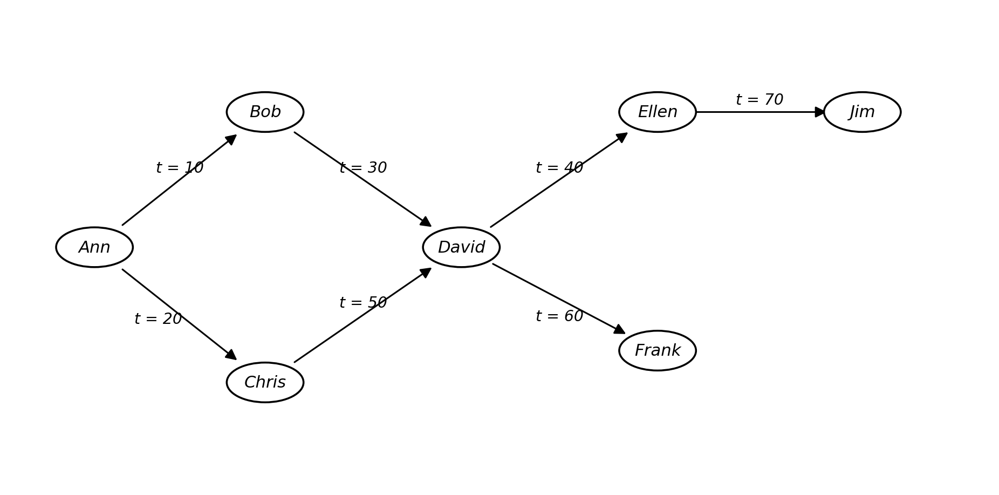
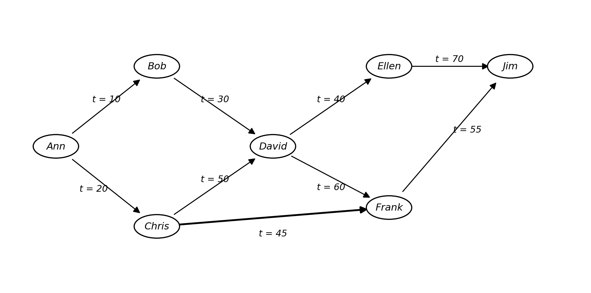

# COS330 — Semester Test Practice Paper
### Reconstructed practice version (based on the 13 October 2023 semester test)
**Closed-book · 50 marks · 120 minutes (suggested)**

> This is a self-study reconstruction covering the same content, diagrams and question types as the original paper. Wording, ordering of options, and surface details have been varied so you can't just pattern-match — you'll need to actually work each one out. Full worked answers are in the separate **Answer Key** section at the end — don't peek until you've attempted every question.

---

## SECTION A — Discretionary Access Control: Grant/Revoke Graphs

The diagrams below show a **DAC authorization graph**: an arrow from person *X* to person *Y* labelled `t = n` means *X granted Y access to some object at time n*. Ann is the original owner/source of the access right.

For each question below, work out who **still has a valid path of access** (i.e. a path from Ann built only from *non-revoked* edges, with grant times that do not decrease as you move along the path) after the stated revocation event. If you believe nobody retains access, answer **"None"** only.

### Diagram 1


### Diagram 2 (an extended version of Diagram 1, with two extra grant paths)


---

**Q1 (2 marks).** Using **Diagram 2**, suppose **David** revokes all of the access he personally granted, at time `t = 55`. Which of the following people will *still* have a valid path of access to an arbitrary object afterwards? *(Select all that apply.)*

- [ ] Frank
- [ ] Ellen
- [ ] Chris
- [ ] Jim
- [ ] Ann
- [ ] Bob
- [ ] David
- [ ] None

**Q2 (2 marks).** Using **Diagram 2**, suppose instead **Bob** revokes all of the access he personally granted, at time `t = 45`. *(Note: this may make one or more entries in an access-matrix table you were given elsewhere inconsistent — if so, simply disregard that and answer based on the graph alone.)* Which people still have a valid path of access afterwards?

- [ ] Chris
- [ ] Ellen
- [ ] Ann
- [ ] Frank
- [ ] David
- [ ] Bob
- [ ] Jim
- [ ] None

**Q3 (2 marks).** Using **Diagram 1**, suppose **David** revokes all of the access he personally granted, at time `t = 55`. Which people still have a valid path of access afterwards?

- [ ] Ellen
- [ ] Frank
- [ ] Chris
- [ ] Bob
- [ ] Jim
- [ ] David
- [ ] Ann
- [ ] None

**Q4 (2 marks).** Using **Diagram 2**, suppose **Chris** revokes all of the access he personally granted, at time `t = 80`. Which people still have a valid path of access afterwards?

- [ ] Jim
- [ ] Bob
- [ ] Frank
- [ ] David
- [ ] Ellen
- [ ] Ann
- [ ] Chris
- [ ] None

**Q5 (2 marks).** Using **Diagram 1**, suppose **David** revokes all of the access he personally granted, at time `t = 100`. Which people still have a valid path of access afterwards?

- [ ] Bob
- [ ] Frank
- [ ] David
- [ ] Ellen
- [ ] Chris
- [ ] Jim
- [ ] Ann
- [ ] None

---

## SECTION B — Authentication Factors (Matching)

**Q6 (5 marks).** For each authentication mechanism on the left, choose the single best-matching category from the option pool. Categories may be reused, and not every category will necessarily be used.

**Items to classify:**

1. A four-digit PIN
2. Answers to a set of security questions arranged in advance with the user
3. A contactless smart card
4. An RSA SecurID-style hardware token
5. A fingerprint scan
6. Facial recognition
7. Hand-vein pattern recognition
8. Voice pattern recognition
9. Handwriting/signature characteristics
10. Keystroke/typing rhythm

**Category option pool** *(letters are not in any meaningful order):*

- **A.** Something the individual owns as property (but which isn't required for the authentication itself)
- **B.** Something the individual possesses
- **C.** Something the individual is
- **D.** Something the individual does
- **E.** Something the system assigns automatically
- **F.** Something the individual knows

*(Write your answer as, e.g., "1 → F".)*

---

## SECTION C — Password Strength Evaluation

**Q7 (5 marks).** For **each** of the following candidate passwords, state whether it is a *suitable* or *poor* choice, and briefly justify your answer (a bare "good"/"not good" with no reasoning earns no marks).

a. `DK33YJGP` — assume this string also happens to be the user's car number-plate.
b. `mfmitm` — chosen by the user as an acronym for *"my favorite movie is tender mercies"*.
c. `Natalie1` — the user's sister is named Natalie.
d. `Washington` — a dictionary/proper-noun word.
e. `ILoveToPlayWithMyDog` — a long phrase-based password with mixed case.

---

## SECTION D — UNIX Default File Permissions

**Q8 (6 marks).** In the traditional UNIX file-permission model, a newly created file or directory is given full access for the **owner**, combined with **one** of the following default settings for group/other:

1. No access at all for group and other.
2. Read/execute access for group, but none for other.
3. Read/execute access for **both** group and other.

For **each** of the three default settings above, briefly state: (i) an **advantage**, (ii) a **disadvantage**, and (iii) **one example type of organisation/environment** where that default would be the sensible choice.

| Default setting | Advantage | Disadvantage | Suitable environment |
|---|---|---|---|
| (1) No access for group/other | | | |
| (2) Read/execute for group only | | | |
| (3) Read/execute for group and other | | | |

---

## SECTION E — Security Requirements for a Real System

**Q9 (6 marks).** A university operates a student-information system. Students are issued a **student number** and a **physical access card** that they use at the entrance turnstiles/gates of campus.

For **each** of Confidentiality, Integrity, and Availability, give **one concrete example requirement** relevant to this specific system, and rate its degree of importance (**Low / Medium / High**) with a short justification.

| CIA property | Example requirement for this system | Degree of importance (L/M/H) |
|---|---|---|
| Confidentiality | | |
| Integrity | | |
| Availability | | |

---

## SECTION F — Database Encryption Debate

**Q10 (5 marks).** Is encrypting a production database (in general) a good idea? Take a position and **thoroughly justify** it — a bare "yes" or "no" with no reasoning earns no marks.

---

## SECTION G — Statistical Inference in Databases

**Q11 (3 marks).** A database table contains a `salary` attribute. Three aggregate queries — **SUM**, **COUNT**, and **MAX** — are issued (in that order) against the *same* filtered subset of records (the same predicate is applied to all three). The system answers the SUM and COUNT queries, but **denies** the MAX query.

Has any sensitive information been leaked despite the denial? Justify your answer fully — a bare "yes"/"no" earns no marks.

---

## SECTION H — Classical Cipher: Columnar Transposition

**Q12 (10 marks).** You are given **two English-phrase keys** and a ciphertext produced with a **double columnar transposition cipher**. Recover the plaintext.

**Keys (used in this order):**
1. `computer security`
2. `this is very easy stuff`

**Assumptions:**
1. Only the **unique letters** of each key are used (repeated letters in a key are only counted once, at their first occurrence).
2. The grid for each transposition stage is exactly **10 rows × 10 columns**.
3. All punctuation/spacing in the original plaintext is ignored during encryption.
4. The padding character is **`X`**.
5. Column order for reading/writing is determined by the **alphabetical rank of each unique key letter** (e.g. the alphabetically-first unique letter of the key becomes column 1, and so on).

**Ciphertext (already split into 5-character blocks for readability):**

```
DXXLE AXXXX RERSI IVGNX
TIILG ONYRX VEONI GSILX
YELIT MFWEX TEANI NRVEX
TASEH GTERX XXXXX XXXXX
IUNIL NTBGX LNNEN LMOSX
```

**Task:**
1. Derive the column-numbering sequence for **each** key (based on alphabetical order of each key's unique letters).
2. Reconstruct the intermediate 10×10 grid produced by undoing the *second* transposition (key 2).
3. Reconstruct the final 10×10 grid produced by undoing the *first* transposition (key 1), and read off the recovered plaintext.

*(Show your row-by-row working — partial marks are awarded for a correct method even if the final read-off has an error.)*

---

*End of practice paper — 50 marks total. Check your answers against the Answer Key section only after attempting every question.*
