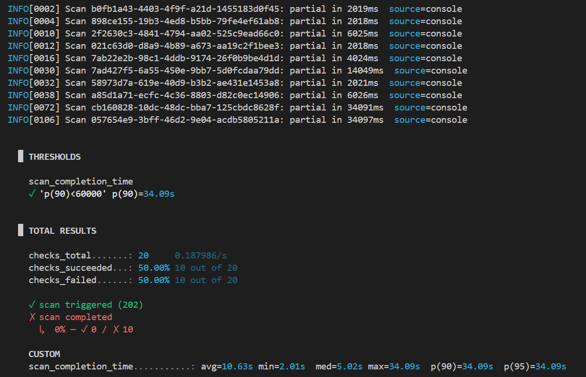
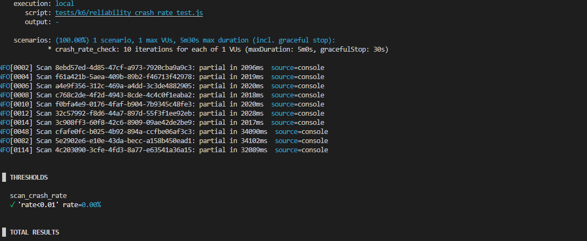
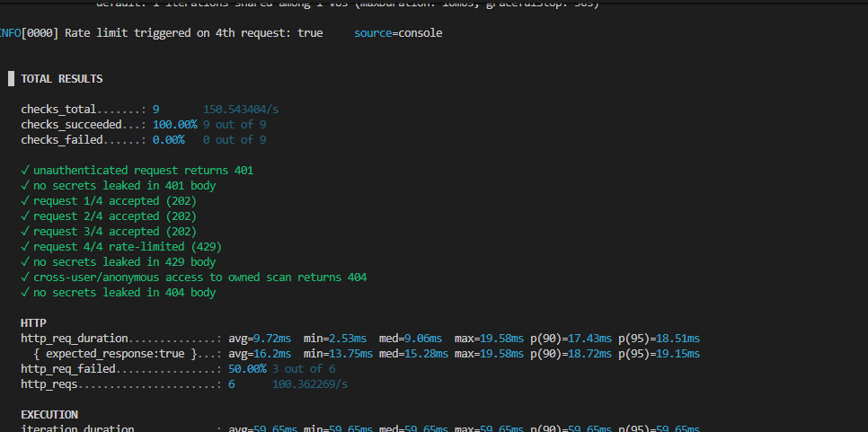

# PenFlow - NFR Testing

---

## Performance

**Objective:** Validate that API response times stay within target under normal load.

**Tool used:** k6

**Test performed:** `tests/k6/load_test.js`, `performance` scenario - 10 constant virtual users hitting `GET /api/v1/health` for 30s against `https://pen-flow.com`.

**Evidence:**

**Result:**
- QR-01: p(95) response time **208.23ms** (target: <2s)
- QR-02 (Phase 1 CTEM scan completion, `tests/k6/phase1_scan_completion_test.js`): p(90) **34.09s** (target: <60s); all 10 runs returned `"partial"` status rather than `"completed"`
- QR-03 (Phase 2 active vulnerability scan completion, `tests/k6/phase2_scan_completion_test.js`): p(90) **25.1s** (target: <30s)

---

## Scalability

**Objective:** Validate that the system remains stable as concurrent users ramp up to 100.

**Tool used:** k6

**Test performed:** `tests/k6/load_test.js`, `scalability` scenario - ramping virtual users from 0 to 100 over 3 stages (30s up / 1m sustained / 30s down) against `GET /api/v1/health`.

**Evidence:**

**Result:**
- QR-04: error rate at peak load **0.00%** (0 failed out of 108,264 requests at up to 110 VUs) against a target of <50% degradation vs. baseline - thresholds held under load, but this run does not isolate a clean baseline measurement to compute degradation against (the `performance` and `scalability` scenarios executed concurrently), so the "<50% degradation vs. baseline" figure is not yet directly measured.
- This run only proves the **API/HTTP layer** stays responsive under load (`GET /api/v1/health` never touches RabbitMQ/Celery). It does **not** yet demonstrate the "horizontal worker scaling + queue-based load leveling" tactic - that would need a scenario against `POST /api/v1/scans/` with the rate limiter temporarily raised for the test.

---

## Reliability

**Objective:** Validate that the system recovers from third-party OSINT API failure and remains available.

**Tool used:** k6, UptimeRobot

**Test performed:** `tests/k6/phase1_scan_completion_test.js` - 10 sequential Phase 1 CTEM scans triggered and polled to completion (same run used for QR-02). Crash rate is measured as the proportion of triggered scans that returned an unhandled error rather than a terminal status (`completed`/`partial`/`failed`).

**Evidence:**

**Result:**
- QR-05 (crash rate on OSINT failure): **0% crash rate (0/10)** against a target of <1% - every scan reached a terminal status, no unhandled errors. 10/10 runs returned `"partial"` status rather than `"completed"`, indicating at least one OSINT source failed/rate-limited during each run - this is the expected graceful-degradation behavior, not a crash. A dedicated script, `tests/k6/reliability_crash_rate_test.js`, also exists for this QR specifically (explicit crash-rate threshold rather than reading it off console logs).
- QR-06 (uptime): TBD - target ≥99%, no UptimeRobot monitor set up yet

---

## Security

**Objective:** Validate that the system has no medium-or-above vulnerabilities and enforces access control correctly.

**Tool used:** OWASP ZAP, k6

**Test performed:** `tests/k6/security_test.js` - checks an unauthenticated request to `GET /api/v1/domains` returns 401, that an anonymous request for another user's scan status returns 404 (not 403 - ownership is enforced by a user_id-scoped lookup), that the 4th `POST /api/v1/scans/` from the same IP within 10 minutes returns 429, and that none of these responses leak secrets/credentials/stack traces.

**Evidence:**

**Result:**
- QR-07 (0 medium+ risk alerts, data encrypted at rest): **2 medium+ alerts found** against a target of 0 - **fails** the target; alerts not yet triaged/fixed
- QR-08 (401 unauthenticated / 404 cross-user): 401 **confirmed** with 0 secrets leaked in the response body; 404 cross-user check still **pending** - needs a real `AUTH_TOKEN` to create an owned scan first (see script comments)
- QR-09 (0 exposed secrets, 429 rate limiting): **confirmed** - 4th `POST /api/v1/scans/` from the same IP returned 429, no secrets leaked in the response body

---

## Maintainability

**Objective:** Validate that merged code passes static analysis and meets coverage targets.

**Tool used:** ESLint / ruff, pytest-cov

**Test performed:** `pnpm lint` (frontend ESLint + backend/workers ruff), and `pytest` with coverage (`backend/pytest.ini`, `workers/pytest.ini`) run across backend + workers, unit + integration, merged via Codecov.

**Evidence:**

**Result:**
- QR-10 (0 lint errors): **0 errors** - `pnpm lint` passes clean (some non-blocking `react-hooks/exhaustive-deps` warnings remain, 0 errors)
- QR-11 (≥80% test coverage): **64.5%** - combined backend + workers coverage (unit + integration, merged by Codecov) is below the 80% target

---

## Usability

**Objective:** Validate that primary user-facing pages are accessible and understandable.

**Tool used:** Google Lighthouse

**Test performed:** Lighthouse accessibility audit against the primary user-facing pages (dashboard, scan results).

**Evidence:**

**Result:**
- QR-12 (Lighthouse accessibility score ≥80): **≥80%** - passes target